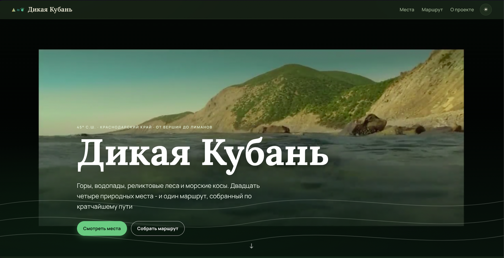
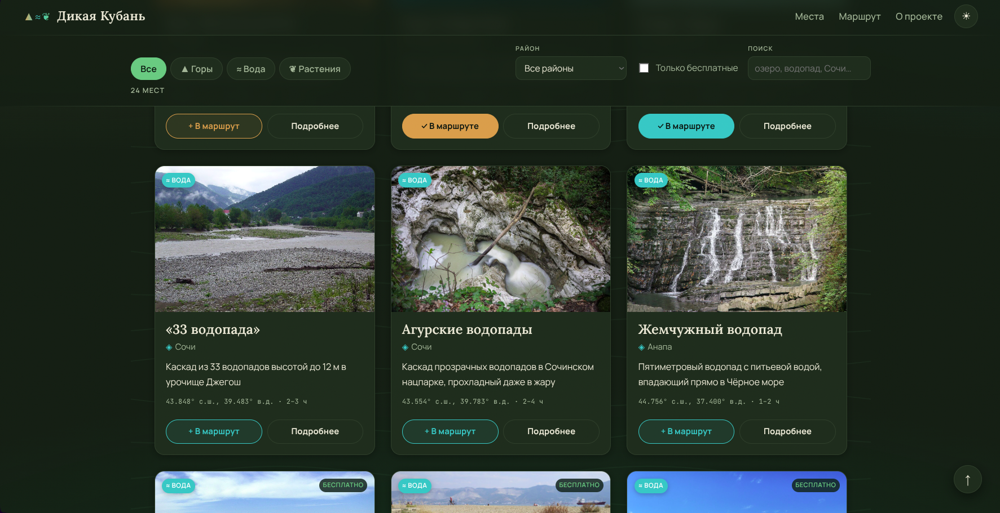
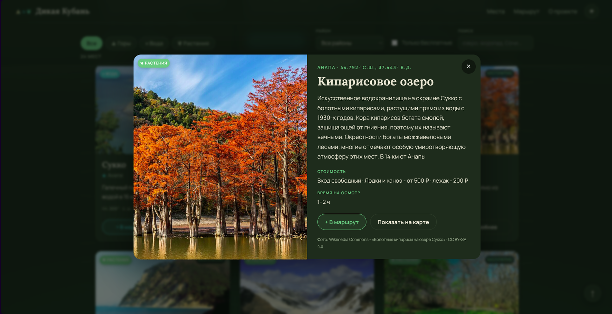
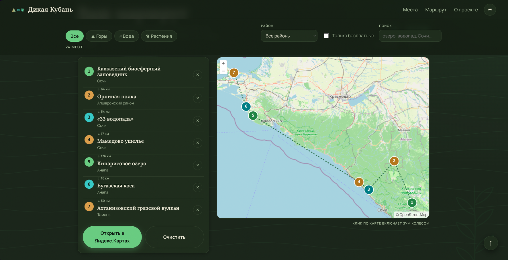

# KK-travel-guide - Wild Kuban
An ecological & local-history travel guide to the wildest natural places of
Krasnodar Krai (Russia). It's a single static page: browse 24 nature spots -
mountains, waterfalls, relict forests and sea spits - filter them by zone,
region or price, and assemble a road trip. Pick the places you want to visit
and the planner reorders them into the shortest driving route between the
points, draws it on a map, and hands the itinerary off to Yandex Maps

**Live site:** https://ovladisluvv.github.io/KK-travel-guide/

<p align="center">
  
  
</p>

<p align="center">
  
  
</p>

## The idea
The project is a personal, non-commercial field guide to the region I care
about. The goals were simple:

- Gather genuinely worthwhile natural landmarks of Krasnodar Krai in one place,
  each with a short description, the natural zone it belongs to, the district,
  visiting time and up-to-date (2025-2026) entry prices
- Let a visitor turn "places I'd like to see" into an actual trip - not just a
  wishlist, but an optimized route with distance and map, ready to open in a
  navigation app
- Keep it honest and lightweight: real photos with proper credits, no tracking,
  no build step, no backend - just files you can host anywhere
- Small comforts for reading and browsing: a light/dark theme toggle and a
  back-to-top button

Design-wise it leans into a "field guide + topographic map" feel: three natural
zones (mountains ▲, water ≈, plants ❦), contour lines, and a calm, outdoorsy palette

## About current implementation
> *This is a vibe-coded refactor of an earlier version of the project*

The current site was rebuilt from scratch following the concept and content of a
previous implementation, which lives in [`archive/`](archive/). The archive is
kept for reference - the old build was a single hand-written HTML page with
inline styles and assets. This rewrite reorganizes the same idea into a clean,
data-driven vanilla site while keeping the spirit and the places intact


## How to run
The website is already live - you can access it by clicking on the
[link](https://ovladisluvv.github.io/KK-travel-guide/). If you'd rather run it locally:

### Local host
There's no build and no dependencies to install. Serve the folder with any
static server and open it in a browser, for example:

```bash
python3 -m http.server 8000
# then visit http://localhost:8000
```

Opening `index.html` directly over `file://` mostly works too, but a local
server is recommended so fonts, video and the map behave correctly

### Docker (optional)
A minimal nginx wrapper is included only for reproducible self-hosting:

```bash
docker compose up --build   # then visit http://localhost:8080
```

## Project structure
- `index.html`, `css/style.css` - the page and its styling
- `js/data.js` - the 24 places (zone, region, coordinates, prices, photo credit)
- `js/route.js` - route optimization (shortest path between selected points)
- `js/app.js` - maps, filters, search and the planner UI
- `assets/` - self-hosted fonts, place photos (Wikimedia Commons) and the hero video
- `vendor/openlayers/` - the vendored map library (OpenStreetMap tiles)
- `archive/` - the previous implementation this version was refactored from

## Licence
The source code of KK-travel-guide is licensed under the MIT License. See [LICENSE](LICENSE)

## Credits & disclaimer
Author - Vladislav Ogai ([ovladisluvv](https://github.com/ovladisluvv))

Photos come from [Wikimedia Commons](https://commons.wikimedia.org/) under
CC BY / CC BY-SA / CC0 / Public Domain licenses and are credited in the page
footer. Map data © OpenStreetMap contributors

Prices and opening details are collected from open sources for 2025–2026 and can
change - check the official pages of each site before you travel
